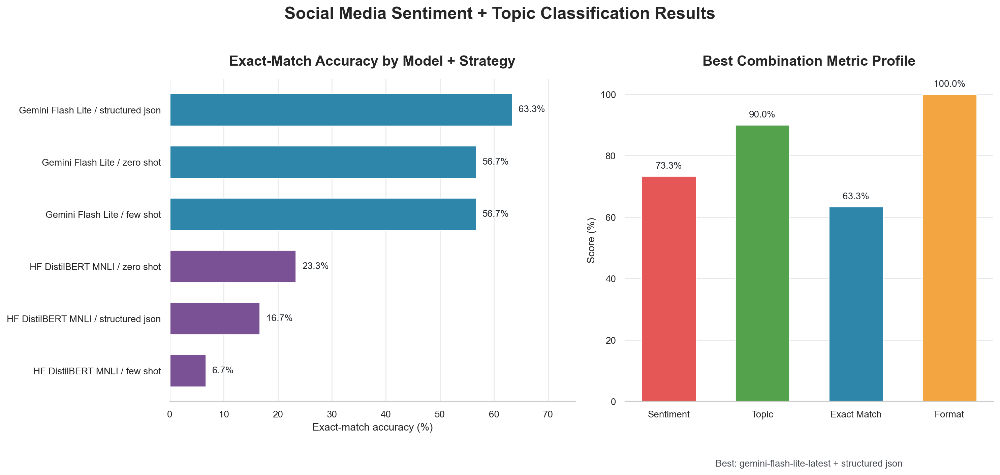

# Results Summary

## Best Combination

The top-performing combination was:

| Model | Strategy | Sentiment Accuracy | Topic Accuracy | Exact-Match Accuracy | Format Compliance |
|---|---|---:|---:|---:|---:|
| `gemini-flash-lite-latest` | `structured_json` | 73.3% | 90.0% | 63.3% | 100.0% |

## Full Results Matrix

| Model | Strategy | Sentiment Accuracy | Topic Accuracy | Exact-Match Accuracy | Format Compliance | Avg. Latency (sec) |
|---|---|---:|---:|---:|---:|---:|
| `gemini-flash-lite-latest` | `structured_json` | 73.3% | 90.0% | 63.3% | 100.0% | 0.070 |
| `gemini-flash-lite-latest` | `few_shot` | 63.3% | 90.0% | 56.7% | 100.0% | 0.085 |
| `gemini-flash-lite-latest` | `zero_shot` | 66.7% | 90.0% | 56.7% | 100.0% | 0.062 |
| `typeform/distilbert-base-uncased-mnli` | `zero_shot` | 40.0% | 43.3% | 23.3% | 100.0% | 0.111 |
| `typeform/distilbert-base-uncased-mnli` | `structured_json` | 33.3% | 40.0% | 16.7% | 100.0% | 0.069 |
| `typeform/distilbert-base-uncased-mnli` | `few_shot` | 36.7% | 30.0% | 6.7% | 100.0% | 0.075 |
